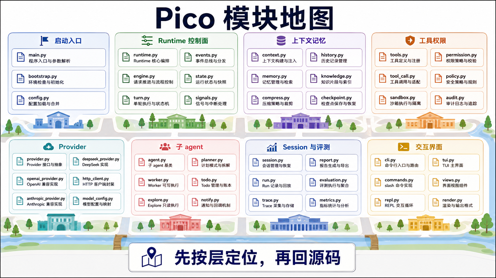

# 模块地图：每个源码文件属于哪一层

这份地图不逐行翻译源码目录，只说明读 DeepCode 时每个文件该放在哪个系统问题下面。遇到追问时，先按层找文件，再回到具体实现。

## 启动和用户入口

| 文件 | 角色 |
| --- | --- |
| `deepcode/__main__.py` | `python -m deepcode` 入口。 |
| `deepcode/__init__.py` | 包导出。 |
| `deepcode/cli.py` | CLI、REPL、TUI 选择、provider/sandbox/session/runtime 装配、slash command 执行。 |
| `deepcode/commands/slash.py` | slash command registry、命令解析、`/subagent` 参数解析。 |
| `deepcode/config/__init__.py` | `.env`、`.deepcode.toml`、全局配置、环境变量、CLI override 的统一解析。 |

## Runtime 控制面

| 文件 | 角色 |
| --- | --- |
| `deepcode/core/runtime.py` | `DeepCode` 主对象，持有工作区、模型、session、memory、tools、workers、permissions、context manager。 |
| `deepcode/core/engine.py` | turn 级主循环，推进模型调用、工具调用、final、stop、checkpoint、report。 |
| `deepcode/core/engine_helpers.py` | 工具执行后的副作用、stop/limited run 收口、provider retry 判断、memory maintenance 包装。 |
| `deepcode/core/model_output.py` | 解析 `<tool>`、XML tool、JSON tool、`<final>`，输出 `tool/tools/final/retry`。 |
| `deepcode/core/tool_executor.py` | 工具执行总闸口，校验、权限、policy、重复调用、snapshot diff、metadata。 |
| `deepcode/core/runtime_events.py` | 构建 runtime trace/event payload。 |
| `deepcode/core/runtime_consumers.py` | runtime event consumer 默认装配。 |
| `deepcode/core/runtime_secrets.py` | secret 识别和 trace/report redaction。 |
| `deepcode/core/runtime_checkpoints.py` | checkpoint 生成、resume state 和 runtime identity 校验。 |
| `deepcode/core/session_lifecycle.py` | clear/resume session 的运行时状态迁移。 |
| `deepcode/core/workspace.py` | 工作区指纹、路径裁剪、分支、忽略目录、时间工具。 |

## Prompt、上下文和压缩

| 文件 | 角色 |
| --- | --- |
| `deepcode/core/context_manager.py` | prompt section、预算、floor、裁剪顺序、metadata。 |
| `deepcode/core/context_usage.py` | prompt/token 估算和 context usage。 |
| `deepcode/core/turn_history.py` | history 渲染、tail clip、文件摘要复用、重复读取折叠。 |
| `deepcode/core/compact.py` | 手动 session compaction，把旧 turn 汇总成 compact summary。 |

## 状态、工件和恢复

| 文件 | 角色 |
| --- | --- |
| `deepcode/core/session_store.py` | session JSON 和 event JSONL 路径、保存、加载、latest、列表。 |
| `deepcode/core/session_events.py` | session event bus 和事件写入。 |
| `deepcode/core/run_store.py` | run 目录、task state、trace、report、artifact 的落盘。 |
| `deepcode/core/task_state.py` | 单次 ask 的状态机快照和 stop reason。 |
| `deepcode/core/artifacts.py` | artifact 相关数据结构或辅助逻辑。 |
| `deepcode/core/model_errors.py` | provider/model error 的 run 收口。 |

## 工具、安全和权限

| 文件 | 角色 |
| --- | --- |
| `deepcode/tools/base.py` | RegisteredTool 和工具结果基础类型。 |
| `deepcode/tools/registry.py` | 基础工具定义、schema、validator、runner。 |
| `deepcode/tools/agents.py` | `agent`、`send_message`、`task_stop` 工具。 |
| `deepcode/tools/ask_user.py` | 反向询问用户的工具。 |
| `deepcode/tools/plan.py` | plan mode 进入/退出工具。 |
| `deepcode/tools/todos.py` | todo 工具定义和 validator。 |
| `deepcode/core/permissions.py` | tool profile、approval、plan mode、write scope 权限决策。 |
| `deepcode/core/tool_policy.py` | fresh read、shell search/read 反模式等行为策略。 |
| `deepcode/core/tool_profiles.py` | default/plan/dream/readonly/worker 工具面定义。 |
| `deepcode/features/sandbox/config.py` | sandbox mode/backend/filesystem 配置。 |
| `deepcode/features/sandbox/runner.py` | bubblewrap 或 plain shell 执行。 |
| `deepcode/features/sandbox/checker.py` | sandbox backend 可用性检查。 |
| `deepcode/features/sandbox/command_matcher.py` | excluded command pattern 判断。 |

## 记忆和技能

| 文件 | 角色 |
| --- | --- |
| `deepcode/features/memory.py` | working memory、durable memory、retrieval、promotion、daily log、dream、auto-dream。 |
| `deepcode/features/skills.py` | skill frontmatter 解析、目录发现、prompt section 渲染、slash 解析。 |
| `deepcode/features/skills_bundled.py` | 内置 skill 定义。 |
| `deepcode/features/skills_runtime.py` | skill invoke 运行逻辑。 |

## 子 agent、计划和任务账本

| 文件 | 角色 |
| --- | --- |
| `deepcode/core/worker_manager.py` | worker 生命周期、spawn/continue/stop、notifications。 |
| `deepcode/core/worker_runtime.py` | child DeepCode runtime 构造，设置 Explore/worker 边界。 |
| `deepcode/core/worker_execution.py` | worker thread 执行、结果写回、通知生成。 |
| `deepcode/core/worker_artifacts.py` | 收集 worker run/report/artifact 信息。 |
| `deepcode/core/worker_notifications.py` | worker notification 文本渲染。 |
| `deepcode/core/plan_mode.py` | plan artifact、plan profile、final gate。 |
| `deepcode/core/todo_ledger.py` | session-scoped todo ledger 和 prompt 渲染。 |

## Provider 和模型协议

| 文件 | 角色 |
| --- | --- |
| `deepcode/providers/base.py` | `ModelResult` 和 `complete_model()` 兼容包装。 |
| `deepcode/providers/clients.py` | OpenAI-compatible `/responses`、Anthropic-compatible `/messages`、SSE/JSON/usage/cache/error 抽取。 |
| `deepcode/providers/errors.py` | ProviderError、错误 metadata、URL 脱敏。 |
| `deepcode/providers/__init__.py` | provider client 导出。 |

## Evaluation 和测试支撑

| 文件 | 角色 |
| --- | --- |
| `deepcode/evaluation/evaluator.py` | 固定 benchmark、fixture、scripted outputs、verifier、artifact 输出。 |
| `deepcode/evaluation/metrics.py` | benchmark/run artifacts 聚合、ablation metrics、report 生成。 |
| `deepcode/testing.py` | `ScriptedModelClient`，让 runtime 测试脱离真实模型。 |

## TUI

| 文件 | 角色 |
| --- | --- |
| `deepcode/tui/main.py` | TUI 命令入口。 |
| `deepcode/tui/app.py` | Textual App，驱动同一个 `Engine.run_turn()` 并渲染事件。 |
| `deepcode/tui/widgets.py` | Welcome、ChatLog、ToolCard、ConfirmPrompt、AskUserPrompt、StatusBar、InputBar 等控件。 |

## 测试文件怎么读

测试可以按能力分组读：

- runtime 主循环：`tests/test_v3_runtime.py`、`tests/test_engine_acceptance.py`、`tests/test_runtime_evidence_acceptance.py`
- context/memory：`tests/test_context_manager.py`、`tests/test_memory.py`、`tests/test_context_governance_acceptance.py`
- tools/security：`tests/test_tool_policy_acceptance.py`、`tests/test_permissions_acceptance.py`、`tests/test_safety_invariants.py`、`tests/test_sandbox_runner.py`、`tests/test_sandbox_config.py`
- workers/todo/plan：`tests/test_agent_workers_acceptance.py`、`tests/test_todo_ledger_acceptance.py`、`tests/test_task_state.py`、`tests/test_ask_user.py`
- evaluation/metrics：`tests/test_evaluator.py`、`tests/test_metrics.py`、`tests/test_business_scenario_dogfood.py`
- product shell：`tests/test_tui.py`、`tests/test_skills_acceptance.py`、`tests/test_run_store.py`、`tests/test_usage.py`、`tests/test_release_smoke.py`

## 一句话记忆

如果只记一个地图：`core/` 管控制和状态，`tools/` 管动作，`features/` 管可插拔能力，`providers/` 管模型协议，`commands/cli/tui` 管用户入口，`evaluation/testing` 管证据。
